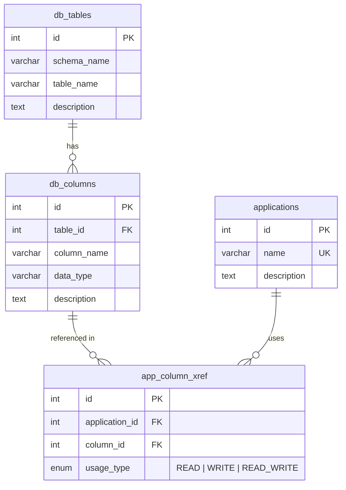

# Database Schema

```mermaid
erDiagram
    applications {
        int id PK
        varchar name UK
        text description
    }

    db_tables {
        int id PK
        varchar schema_name
        varchar table_name
        text description
    }

    db_columns {
        int id PK
        int table_id FK
        varchar column_name
        varchar data_type
        text description
    }

    app_column_xref {
        int id PK
        int application_id FK
        int column_id FK
        enum usage_type "READ | WRITE | READ_WRITE"
    }

    db_tables ||--o{ db_columns : "has"
    db_columns ||--o{ app_column_xref : "referenced in"
    applications ||--o{ app_column_xref : "uses"
```
